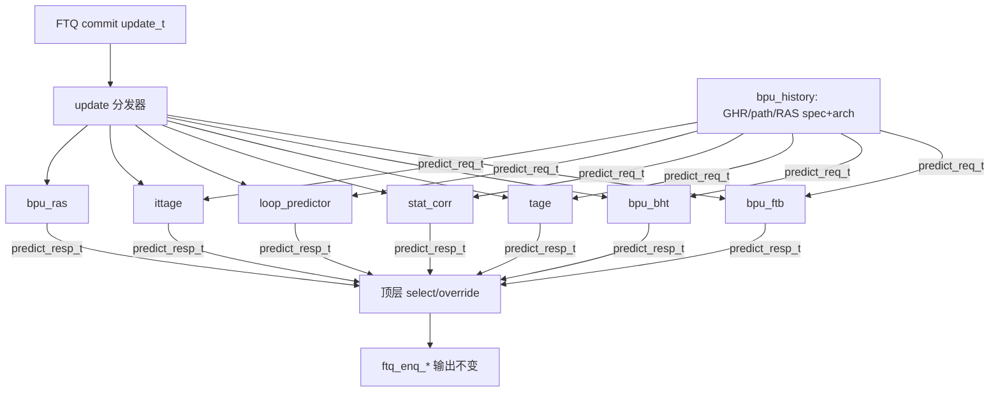

# BPU 重构方法论与实践

本文档记录 `npc/vsrc/frontend/bpu.sv` 模块化重构的**不变式、分步计划、golden 行为签名与日常门禁**。重构目标是拆分约 770 行 `always_ff`，**只改作用域与连线，不改预测/更新算法**。

## 背景

| 项 | 说明 |
|----|------|
| 现状 | `bpu.sv` 约 1600+ 行；核心 `always_ff` 揉合 FTB 训练、BHT/tournament、RAS、GHR/path、override 追踪 FIFO、`dbg_*` 计数器与 `pred_snap_*` 快照 |
| 已抽出 | `predictor/tage.sv`、`stat_corr.sv`、`loop_predictor.sv`、`ittage.sv`（扁平 `predict_*` / `update_*` 口） |
| 仍内联 | FTB/BTB、BHT/tournament、RAS、共享历史、update 分发、全部 dbg/snapshot |
| 行为出口 | `tb_triathlon.sv` 的 `dbg_bpu_*_o` → `profile_collector_json.cpp` → profile JSON / golden baseline |

## 不变式（贯穿全程）

1. **算法不变**：一行预测/更新逻辑表达式不改；搬运只改模块边界与连线。
2. **对外端口不变**：`bpu.sv` 顶层端口（FTQ enqueue 等）保持原签名。
3. **诊断出口不变**：`dbg_bpu_*_o` 层级引用可随子模块搬迁调整，但 **TB 对外信号名与语义** 不变，保证 profiler / golden 持续有效。
4. **每步必验**：`make verify-bpu-golden`（行为签名）+ `make verify-all`（DiffTest / ASSERT / cover）。

## 分步计划（Strangler Fig）



| 步骤 | 内容 | 状态 |
|------|------|------|
| **Step 0** | 系统级 golden baseline + `verify-bpu-golden` | **已完成** |
| **Step 1** | 新建 `bpu_pkg.sv`：`predict_req_t` / `predict_resp_t` / `update_t`，顶层内部收口 | 待做 |
| **Step 2** | 逐个抽叶子：RAS → FTB → BHT（每步跑 golden） | 待做 |
| **Step 3** | 拆解 `always_ff`：update 分发 + override FIFO 随模块迁移；`pred_snap_*` 留顶层或 `bpu_dbg.sv` | 待做 |
| **Step 4** | `bpu_history.sv`：GHR/path 推测更新与 flush 回滚 | 待做 |

### Step 1 契约（预览）

```systemverilog
// npc/vsrc/include/bpu_pkg.sv（规划）
predict_req_t  { valid; pc; ghr; path; }
predict_resp_t { hit; taken; target; provider; meta; }
update_t       { valid; pc; taken; target; mispred; is_cond/call/ret/rvc; meta; }
```

子模块仅通过上述 bundle 与顶层交互；TB 仍读 `dbg_bpu_*_o`，不直接绑子模块内部信号。

## Step 0：Golden 行为基准（已实现）

### 思路

- **不做**独立 BPU 单元 replay；复用 **DiffTest + profiler** 系统级链路。
- 固定 benchmark 镜像集跑仿真，从 profile JSON 抽取 **`kpi.cycles` + 全部 `dbg_bpu` 计数器**，写入 baseline JSON。
- 回归时对 baseline **逐字段整数 diff**；任一字段或 cycle 变化即判定行为退化。

### 固定 IMG 集

| Benchmark | 镜像 | progress |
|-----------|------|----------|
| coremark | `am-kernels/benchmarks/coremark/build/coremark-riscv32im-npc.bin` | 1000000 |
| dhrystone | `am-kernels/benchmarks/dhrystone/build/dhrystone-riscv32im-npc.bin` | 50000 |

DiffTest **开启**（与 `verify-difftest` 一致）；profile 写入 `--profile-json`。

### 行为签名来源

1. RTL：`tb_triathlon.sv` 将 `dut.u_frontend.i_bpu.*` 映射到 `dbg_bpu_*_o`。
2. C++：`profile_collector_json.cpp` 在 profile JSON 根级写入 **`dbg_bpu`** 区块（与 TB 计数器一一对应）。
3. 脚本：`scripts/golden/bpu_golden.py` 提取 `kpi.cycles` + `dbg_bpu.*`，合并为 baseline。

`pred_snap_*` 为 FTQ 宽位快照，**不计入** golden baseline（仅数值型 `dbg_bpu_*` 计数器 + cycles）。

### 文件布局

| 路径 | 作用 |
|------|------|
| `npc/scripts/subshell/run_bpu_golden.sh` | 构建、跑 IMG、合并 JSON、diff 或刷新 baseline |
| `npc/scripts/golden/bpu_golden.py` | `extract` / `merge` / `diff` 子命令 |
| `npc/scripts/golden/bpu_baseline.json` | 已提交的 golden 基准（`schema_version: 1`） |

### 常用命令

在仓库根或 `npc/` 下、**WSL/Linux bash** 执行：

```bash
# 回归：与 baseline 逐字段对比（约 3–4 分钟，含 tb_triathlon 重建）
make -C npc verify-bpu-golden

# 确认行为变更 intentional 后，刷新 baseline 并提交 JSON
make -C npc verify-bpu-golden-update

# BPU 重构每步完成后建议
make -C npc verify-bpu-golden && make -C npc verify-all
```

手动调用 Python 工具：

```bash
# 从单次 profile JSON 查看抽取结果
python3 npc/scripts/golden/bpu_golden.py extract npc/profile/xxx/coremark.json

# 对比两个 baseline 文件
python3 npc/scripts/golden/bpu_golden.py diff \
  npc/scripts/golden/bpu_baseline.json /tmp/bpu_current.json
```

### baseline JSON 结构

```json
{
  "schema_version": 1,
  "benchmarks": {
    "coremark": {
      "cycles": 1224281,
      "dbg_bpu": {
        "cond_update_total": 314598,
        "ftb_lookup_total": 1142134,
        "...": "..."
      }
    },
    "dhrystone": { "...": "..." }
  }
}
```

diff 失败时输出 `benchmarks.<bench>.dbg_bpu.<field>: baseline=… current=…`。

### 刷新 baseline 的准入条件

仅在以下情况运行 `verify-bpu-golden-update` 并 git 提交 `bpu_baseline.json`：

- 重构步确认 **算法/行为 intentionally 不变**，但修复了 golden 未覆盖的 bug（需另述）；
- 或 ** intentional 算法变更** 且 DiffTest + `verify-all` 全绿，团队认可新行为。

禁止在 golden diff 失败时直接刷 baseline 掩盖回归。

## 重构实践要点

### 1. 先签名、后搬家

每抽一个子模块前确保 `verify-bpu-golden` 全绿；搬迁 `dbg_*_q` 时同步更新 `tb_triathlon.sv` 层级路径，再跑 golden。

### 2. 层级引用是校验点

```systemverilog
// tb_triathlon.sv — 子模块化后只改右侧层次路径，左侧 dbg_bpu_*_o 不变
assign dbg_bpu_cond_update_total_o = dut.u_frontend.i_bpu.dbg_cond_update_total_q;
// 例：迁入 bpu_bht 后可能变为
// assign ... = dut.u_frontend.i_bpu.u_bht.dbg_cond_update_total_q;
```

### 3. profile JSON 的 `dbg_bpu` 块

与 golden 共用数据源。若在 C++ 增删计数器字段，需同步：

- `tb_triathlon.sv` 端口
- `profile_collector_json.cpp` 的 `append_dbg_bpu_section`
- `bpu_golden.py`（自动读取 JSON 键，一般无需改）
- 刷新 `bpu_baseline.json`

### 4. 与性能 profile 的关系

| 工具 | 目的 |
|------|------|
| `verify-bpu-golden` | **行为等价**（cycles + BPU 计数器 bit-exact） |
| `profile-report` / `compare_summary.py` | **性能趋势**（IPC/CPI/stall，允许阈值内波动） |

BPU 纯重构应通过 golden 且 IPC 无明显意外下降；性能回归用 [profile.md](profile.md)。

## 验证节奏（推荐）

```
每完成 Step 1 子步 / Step 2 每抽一模块 / Step 3–4 里程碑
    │
    ├─ make -C npc verify-bpu-golden     ← 行为签名
    └─ make -C npc verify-all            ← DiffTest + ASSERT + cover
```

任一 golden 字段非零 diff → 回退该步重做，禁止带 diff 合并。

## 相关文档

- [verification.md](verification.md) — `verify-*` 总览（含 `verify-bpu-golden`）
- [profile.md](profile.md) — profile JSON schema、`dbg_bpu` 写入时机
- [difftest.md](difftest.md) — DiffTest 机制
